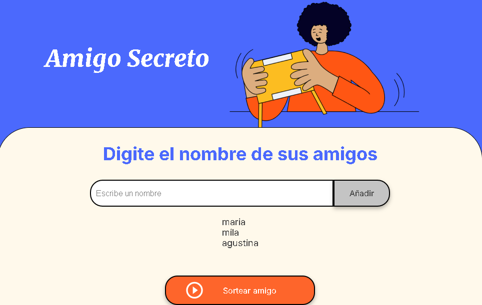
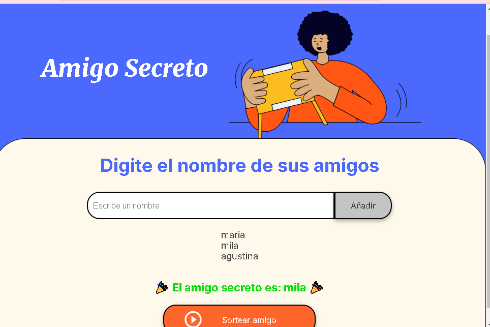

# juego-amigoSecreto
Un proyecto simple para realizar un sorteo de amigo secreto usando JavaScript
🎁 Juego de Amigo Secreto

Este es un pequeño proyecto interactivo para realizar un sorteo de **Amigo Secreto**, desarrollado con **HTML, CSS y JavaScript**.

## 🚀 Funcionalidades

✔ Permite agregar nombres a una lista.  
✔ Valida que los nombres no estén en blanco.  
✔ Realiza el sorteo y muestra el resultado.  
✔ Diseño sencillo y responsivo.

capturas de pantallas 
🔹 _Pantalla principal_  


🔹 _Sorteo realizado_  



## 🛠 Instalación y Uso

1. Clona el repositorio:
   ```bash
   git clone https://github.com/rociot1234/juego-amigoSecreto.git
   ```
2. Abra el archivo index.htmlen su navegador.
3. Ingresa los nombres y presiona "Sortear amigo".
   🖥Tecnologías utilizadas
   HTML
   CSS
   JavaScript
   📌 Próximas Mejoras (Opcional)
   🔹Evitar nombres duplicados.
   🔹 Permitir borrar nombres de la lista.
   🔹 Agregar animaciones.

✉ Creado por: rociot1234